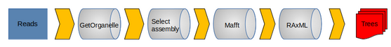

# ChloroBras!

## Overview

ChloroBras is a nextflow pipeline allowing the automatic assembly and analysis of chloroplast genome, developed for *Brassica* but transposable to any family of flowering plants.

- Chloroplast genome assembly by **GetOrganelle**

- A python script (**rename_fasta_header.py**) renames the headers after the assembly according to the name of the sample and the assembly number.

- Selection of the assembly with the Small Single Copy in the right direction (**GetOrganelle** provides two assemblies per sample with the only difference being the direction of the SSC). The bash script (**script_selection_assembly.sh**) selects the correctly structured GetOrganelle assembly thanks to a short highly conserved sequence of the ndhF gene located on the SSC.

- Alignment with **Mafft**

- Phylogenetic tree by **RAxML**

## Instruction

- Install Nextflow and Conda.

- Download and place in the same folder **ChloroBras**, **nextflow.config** and **Tools** (environnements conda, scripts file and reference fasta).

- Create a directory **Samples** with sequences to use. These should have a structured name like: **xxx_R1.fastq.gz** and **xxx_R2.fastq.gz**. 

    It is possible to use symbolic links, which can be created with the following command:

    `ln -s path/to/xxx_R1.fastq.gz xxx_R1.fastq.gz`

- WARNING! : Compatibility problem between latest version of Gnuplot and Mummer

    => delete the 3 “set mouse” lines in the work/conda/mummer/opt/mummer-3.23/mummerplot file created after installation of the conda environment : `sed -i '/set mouse/d' ./work/conda/mummer*/opt/mummer-3.23/mummerplot`

- Run the pipeline : `nextflow run ChloroBras.nf --option` (Options are optional, see next topic) 

- Results will be created in a Results folder !

## Parameters

Each of the following parameters can be specified as command line options or in the config file (**nextflow.config**)

    Reads directory
    --readsFiles                    Path to input data, default: "./Samples/*_R{1,2}.fastq.gz"

    Results directory
    --resultsDir                    Path to results directory, default: "./Results/"

    GetOrganelle
    --getorganelle_index            Index of GetOrganelle, default: "embplant_pt"
    --getorganelle_kmer             Size of kmers, default: "21,45,65,85,105"

    Rename_headers
    --rename_script                 Path to rename_fasta_header.py, default: "./Tools/rename_fasta_header.py"

    Nucmer
    --nucmer_ref                    Path to Fasta reference for alignment, default: "./Tools/brassica_oleracea.fasta"

    Mummer
    --mummer_axe                    Size of X-axis (fonction of genome's size), default (plastome): "'[0:154000]'"
    --mummer_format_output          Format of the plot, default: "png"

    Select_assembly
    --select_assembly_script        Path to script_selection_assembly.sh, default: "./Tools/script_selection_assembly.sh"

    Mafft
    --mafft_method                  Alignment methods, default: "auto"

    Raxml
    --raxml_model                   Model uses by RAxML, default: "GTRGAMMAI"

- The help message can be displayed with the command `nexftlow run ChloroBras.nf --help`
    
## Documentation

GetOrganelle: https://github.com/Kinggerm/GetOrganelle

MAFFT: https://mafft.cbrc.jp/alignment/software/

MUMmer/NUCMER: https://mummer4.github.io/index.html

Nextflow: https://www.nextflow.io/docs/latest/index.html

RAxML: https://cme.h-its.org/exelixis/web/software/raxml/

## References
    
P. Di Tommaso, et al. Nextflow enables reproducible computational workflows. Nature Biotechnology 35, 316–319 (2017) doi:10.1038/nbt.3820

Freudenthal, Jan A., Simon Pfaff, Niklas Terhoeven, Arthur Korte, Markus J. Ankenbrand, et Frank Förster. « A Systematic Comparison of Chloroplast Genome Assembly Tools ». Genome Biology 21, n o 1 (décembre 2020): 254. https://doi.org/10.1186/s13059-020-02153-6.

Jin, Jian-Jun, Wen-Bin Yu, Jun-Bo Yang, Yu Song, Claude W. dePamphilis, Ting-Shuang Yi, et De-Zhu Li.« GetOrganelle: A Fast and Versatile Toolkit for Accurate de Novo Assembly of Organelle Genomes ». GenomeBiology 21, n o 1 (décembre 2020): 241. https://doi.org/10.1186/s13059-020-02154-5.

Katoh, K. « MAFFT: a novel method for rapid multiple sequence alignment based on fast Fourier transform ». Nucleic Acids Research 30, n o 14 (15 juillet 2002): 3059-66. https://doi.org/10.1093/nar/gkf436.

Marçais, Guillaume, Arthur L. Delcher, Adam M. Phillippy, Rachel Coston, Steven L. Salzberg, et Aleksey Zimin. « MUMmer4: A Fast and Versatile Genome Alignment System ». Édité par Aaron E. Darling. PLOS Computational Biology 14, n o 1 (26 janvier 2018): e1005944. https://doi.org/10.1371/journal.pcbi.1005944.

Stamatakis, Alexandros. « RAxML Version 8: A Tool for Phylogenetic Analysis and Post-Analysis of Large Phylogenies ». Bioinformatics 30, n o 9 (1 mai 2014): 1312-13. https://doi.org/10.1093/bioinformatics/btu033.
