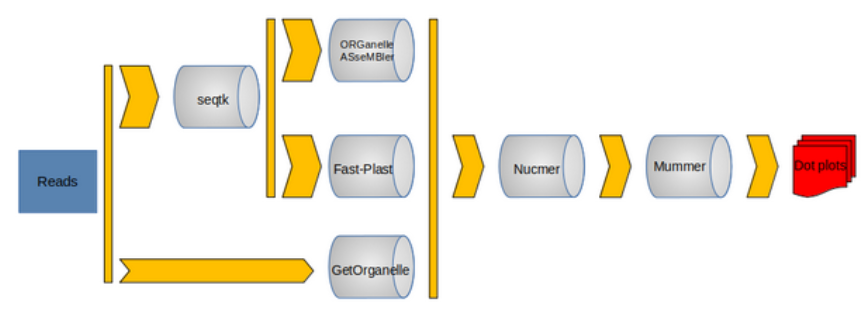

# ChloroBras!

## Overview

ChloroBras is a nextflow pipeline allowing the automatic assembly and analysis of chloroplast genome from paired Illumina reads, developed for *Brassica* but transposable to any family of flowering plants.

**Test Mode**

- Sub-sampling step via **Seqtk** for **Fast-Plast** and **ORGanelle ASseMbler** 1 
- Chloroplast genome assembly by **GetOrganelle**, **Fast-Plast**, **ORGanelle ASseMbler**
- Alignment with **Nucmer** thanks a reference genome 
- Visualization of the quality of these assemblies via a dot-plot created by **Mummer**.

**Analysis Mode**

- Chloroplast genome assembly by **GetOrganelle** 2  (you can choose **Fastplast**).
- Selection of the assembly with the Small Single Copy in the right direction (**script_selection_assembly.sh**) 3 
- Alignment with **Mafft**
- Phylogenetic tree by **RAxML**

>  1  samples from which the pipeline was developed were originally intended for the study of nuclear polymorphisms so the assembly could take several days because of the large number of reads present. **GetOrganelle** is able to perform its own subsampling.

>  2  produced the best results with our data set

>  3  **GetOrganelle** provides two assemblies per sample with the only difference being the direction of the SSC. The bash script selects the correctly structured GetOrganelle assembly thanks to a short highly conserved sequence of the ndhF gene located on the SSC.

## Instruction

- Install Nextflow, Conda and Singularity.

- Download and place in the same folder **ChloroBras.nf**, **nextflow.config** and **Tools** (contains script files and reference fasta).

- Create a directory **Samples** with sequences to use. These should have a structured name like: **xxx_R1.fastq.gz** and **xxx_R2.fastq.gz**. 

    It is possible to use symbolic links, which can be created with the following command:

    `ln -s path/to/xxx_R1.fastq.gz xxx_R1.fastq.gz`

- Run the pipeline : `nextflow run ChloroBras.nf --workflow [test/analysis]`

- See results in Results folder !

## Parameters

Each of the following parameters can be specified as command line options or in the config file (**nextflow.config**)

    REQUIRED parameter

    Workflow
    --workflow [test/analysis]      test : assembles genomes with the three assemblers, allows quality assessment via dotplot
                                    analysis : assemble genomes with getorganelle and create phylogenetic tree

    OPTIONAL parameter

    Executor
    --executor                      Choose the executor (local or slurm). Default: local

    Analysis assembler
    --analysis_assembler [getorganelle/fastplast] Change the assembler used to the analysis workflow. Default: getorganelle

    Reads directory
    --readsFiles                    Path to input data, default: "./Samples/*_R{1,2}.fastq.gz"

    Results directory
    --resultsDir                    Path to results directory, default: "./Results/"

    GetOrganelle
    --getorganelle_index            Index of GetOrganelle, default: "embplant_pt"
    --getorganelle_kmer             Size of kmers, default: "21,45,65,85,105"

    Sqtk
    --seqtk_nb_read                 Number of reads to keep, default: 2000000

    FastPlast
    --fastplast_index               Index of Fast-Plast, default: "Brassicales"

    OrgAsm
    --orgasm_probes                 Index of ORGanelle ASeMbler, default: "protChloroArabidopsis"

    Nucmer
    --nucmer_ref                    Path to Fasta reference for alignment, default: "./Tools/*.fasta"

    Mummer
    --mummer_axe                    Size of X-axis (fonction of genome's size), default (plastome): "'[0:154000]'"
    --mummer_format_output          Format of the plot, default: "png"
    
    Mafft
    --mafft_method                  Alignment methods, default: "auto"

    Raxml
    --raxml_model                   Model uses by RAxML, default: "GTRGAMMAI"
    
    Script
    --rename_script                 Path to rename_fasta_header.py, default: "${params.baseDir}/Tools/rename_fasta_header.py"
    --select_assembly_script        Path to script_selection_assembly.sh, default: "${params.baseDir}/Tools/script_selection_assembly.sh"
    --multi2one_script              Path to script convert_multiline_oneline.sh, default: "${params.baseDir}/Tools/convert_multiline_oneline.sh

- The help message can be displayed with the command `nexftlow run ChloroBras.nf --help`
    
## Documentation

- Nextflow: https://www.nextflow.io/docs/latest/index.html

- Conda: https://conda.io/projects/conda/en/latest/user-guide/install/index.html

- Singularity: https://docs.sylabs.io/guides/3.0/user-guide/quick_start.html

- GetOrganelle: https://github.com/Kinggerm/GetOrganelle

- Fast-Plast: https://github.com/mrmckain/Fast-Plast

- ORGanelle ASseMbler: https://git.metabarcoding.org/org-asm/org-asm

- Seqtk: https://github.com/lh3/seqt

- MUMmer/NUCMER: https://mummer4.github.io/index.html

- MAFFT: https://mafft.cbrc.jp/alignment/software/

- RAxML: https://cme.h-its.org/exelixis/web/software/raxml/

## References
    
P. Di Tommaso, et al. Nextflow enables reproducible computational workflows. Nature Biotechnology 35, 316–319 (2017) doi:10.1038/nbt.3820

Freudenthal, Jan A., Simon Pfaff, Niklas Terhoeven, Arthur Korte, Markus J. Ankenbrand, et Frank Förster. « A Systematic Comparison of Chloroplast Genome Assembly Tools ». Genome Biology 21, n o 1 (décembre 2020): 254. https://doi.org/10.1186/s13059-020-02153-6.

Jin, Jian-Jun, Wen-Bin Yu, Jun-Bo Yang, Yu Song, Claude W. dePamphilis, Ting-Shuang Yi, et De-Zhu Li.« GetOrganelle: A Fast and Versatile Toolkit for Accurate de Novo Assembly of Organelle Genomes ». GenomeBiology 21, n o 1 (décembre 2020): 241. https://doi.org/10.1186/s13059-020-02154-5.

Katoh, K. « MAFFT: a novel method for rapid multiple sequence alignment based on fast Fourier transform ». Nucleic Acids Research 30, n o 14 (15 juillet 2002): 3059-66. https://doi.org/10.1093/nar/gkf436.

Marçais, Guillaume, Arthur L. Delcher, Adam M. Phillippy, Rachel Coston, Steven L. Salzberg, et Aleksey Zimin. « MUMmer4: A Fast and Versatile Genome Alignment System ». Édité par Aaron E. Darling. PLOS Computational Biology 14, n o 1 (26 janvier 2018): e1005944. https://doi.org/10.1371/journal.pcbi.1005944.

Stamatakis, Alexandros. « RAxML Version 8: A Tool for Phylogenetic Analysis and Post-Analysis of Large Phylogenies ». Bioinformatics 30, n o 9 (1 mai 2014): 1312-13. https://doi.org/10.1093/bioinformatics/btu033.

Kurtzer, Gregory M., Vanessa Sochat, et Michael W. Bauer. « Singularity: Scientific Containers for Mobility of Compute ». Édité par Attila Gursoy. PLOS ONE 12, n o 5 (11 mai 2017): e0177459. https://doi.org/10.1371/journal.pone.0177459.

Fast-Plast: McKain et Wilson, 2017

ORGanelle ASseMbler : Coissac et al. 2019
