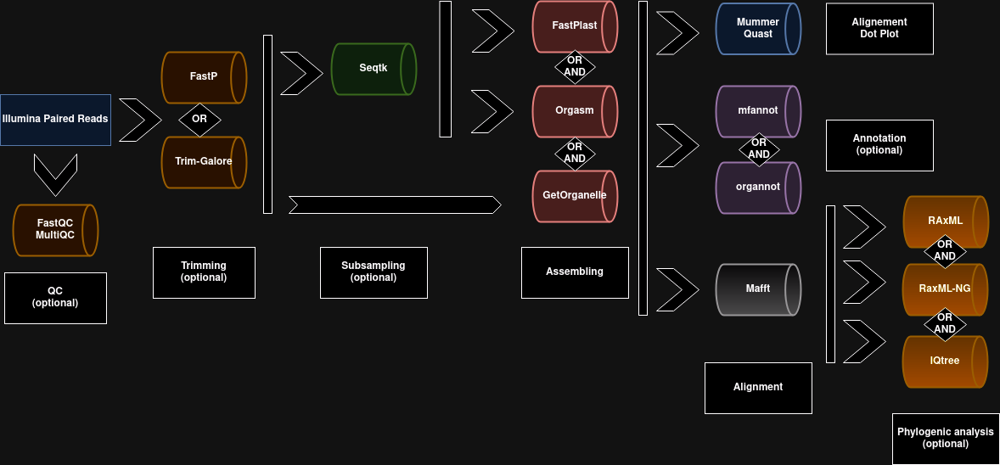
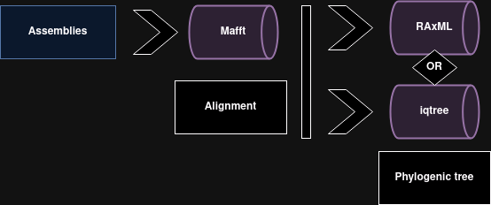

# ChloroBras!

## Overview

ChloroBras is a nextflow pipeline allowing the automatic assembly and analysis of chloroplast genome from paired Illumina reads, developed for *Brassica* but transposable to any family of flowering plants.

**fromReads Mode**



- QC (optional)
- Trimming with **fastp** or **trimgalore** (optional)
- Sub-sampling step (optional) via **Seqtk** for **Fast-Plast** and **ORGanelle ASseMbler**<sup> 1 </sup>.
- Chloroplast genome assembly by **GetOrganelle**<sup> 2 </sup> or/and **Fast-Plast** or/and **ORGanelle ASseMbler**. 
- Alignment thanks a reference genome and visualization via a dot-plot by **Mummer** and stats by **Quast** (optional)
- Annotation with **mfannot** or/and **organnot** (optional)
- Alignment with **Mafft** and Phylogenetic tree by **RAxML** or/and **IQtree** or/and **RAxML-NG** (optional)

> <sup> 1 </sup> samples from which the pipeline was developed were originally intended for the study of nuclear polymorphisms so the assembly could take several days because of the large number of reads present. **GetOrganelle** is able to perform its own subsampling.

> <sup> 2 </sup> **GetOrganelle** provides two assemblies per sample with the only difference being the direction of the SSC. A bash script selects the correctly structured GetOrganelle assembly thanks to a short highly conserved sequence of the ndhF gene located on the SSC.

---------------------------------------------------------------------------------------------------------------------------------------------------------------------------------------------------------------

**fromAsm Mode**



- Annotation with **mfannot** or/and **organnot** (optional)
- Alignment with **Mafft** from pre-existing assembly
- Phylogenetic tree by **RAxML** or/and **IQtree** or/and **RAxML-NG**.

## Quick start

1) Install Nextflow, Conda, Docker and Singularity (see links below).

2) Download and place in the same folder **ChloroBras.nf**, **nextflow.config**, **Data** (contains reference) and **bin** (contains script files). `git clone https://github.com/alexisbourdais/ChloroBras/`

3) Add to **Data/** Illumina paired reads to use or select a directory with `--readDir`. Sequences should have a structured name like: **xxx_R1.fastq.gz** and **xxx_R2.fastq.gz** but you can change the format with `--baseReadName` et `--formatReadName`.

    It is possible to use symbolic links, which can be created with the following command:

    `ln -s path/to/xxx_R1.fastq.gz xxx_R1.fastq.gz`
  
4) Run the pipeline : `nextflow run ChloroBras.nf -profile [standard/slurm,singularity/conda] --singularity "-B root/to/mount/" --workflow fromReads`

4') or edit **LaunChlorobras.sh**, then `chmod +x LaunChlorobras.sh` and `./LaunChlorobras.sh`

5) Check the quality of the assemblies using the graph in the **Results/Mummer** folder and keep the desired ones in the **Results/Assembly** folder. If you have pre-existing assemblies, you can add them here.

6) Run the pipeline : `nextflow run ChloroBras.nf --workflow fromAsm --phylogeny [raxml, iqtree, raxmlng, all]`

## Parameters

- Each of the following parameters can be specified as command line options or in the **launch file**.
- The help message can be displayed with the command `nexftlow run ChloroBras.nf --help`


```
    REQUIRED parameter

    -profile [standard]/slurm,      Select profile standard (local) or slurm. Default: standard          
             singularity/conda      Select profile singularity or conda. (FastPlast, Orgasm, mfannot and organnot are only available with singularity, even in conda profile)
                                                                         (Mummer is only available with conda, even in singularity profile)

    --workflow [fromReads/fromAsm]     fromReads : chloroplast genome assembly, annotation, quality assessment with quast and dotplot, phylogeny analysis from paired reads
                                       fromAsm : mafft alignement, annotation, phylogeny analysis from assemblies

    Singularity
    --singularity           Mounted directory, default: "-B /scratch:/scratch -B /home:/home -B /local:/local -B /db:/db -B /groups:/groups"

    OPTIONAL parameter              

    Reads directory
    --readDir               Default: "./Data"
    --baseReadName          Default: "_R{1,2}"     ex: name_R1.fastq.gz & name_R2.fastq.gz
    --formatReadName        Default: ".fastq.gz"

    Results directory
    --resultsDir            Path to results directory, default: "./Results/"

    Assembly directory
    --assemblyDir           Path to assembly directory, default: "./Results/Assembly/"
    --formatAsm             Default: ".fasta"

    Assembler
    --assembler             Choose assembler to use (['getorganelle'], 'fastplast', 'orgasm' or 'all') 
                            Phylogeny analysis is not available with 'orgasm' and 'all'.
    Quality control
    --qc                    To activate qc

    Trimming
    --trimming              Add trimming step with 'fastp' or 'trimgalore'. Default: none

    Annotation
    --annotation            Add annotation step ('all', 'mfannot', 'organnot'). Default: none            

    GetOrganelle
    --getIndex              Index of GetOrganelle, default: "embplant_pt"
    --getKmer               Size of kmers, default: "21,45,65,85,105"

    Sqtk
    --seqtkSubsamp          Subsampling for Orgasm and FastPlast, default: 2000000. 
                            Set to 0 to deactivate (assembly can be time-consuming)
    FastPlast
    --fastIndex             Index of Fast-Plast, default: "Brassicales"

    OrgAsm
    --orgasmProbes          Index of ORGanelle ASeMbler, default: "protChloroArabidopsis"

    Mummer - Quast
    --quast                 Activate quast : produce stats and circos between ref and assemblies.
    --refFasta              Path to Fasta reference for alignment and quast, default: "./Data/Brassica-oleracea-isolate-HDEM-chloroplast.fasta"
    --refGff                Path to Gff reference for quast, default: "./Data/Brassica-oleracea-isolate-HDEM-chloroplast.gff3"
    --mummerAxe             Size of X-axis (fonction of genome's size), default (plastome): "'[0:154000]'"
    --mummerFormatOut       Format of the plot, default: "png"

    Mafft
    --mafftMethod           Alignment methods, default: "auto"

    Phylogeny
    --phylogeny             Add phylogenetic step ('raxml', 'iqtree', 'raxmlng' or 'all'). Default : none

    Raxml
    --raxmlModel            Model uses by RAxML, default: "GTRGAMMAI"

    IQtree
    --iqtreeModel           Model uses by IQtree, default: "GTR+I+G"
    --iqtreeOption          Use to add option to iqtree: "--option argument"

    Raxml-ng
    --raxmlngModel          Model uses by RAxML-NG, default: "GTR+G+I"
    --raxmlngBootstrap      Bootstrap number, default: 200
    --raxmlngOption         Use to add option to Raxml-ng: "--option argument"
```

## Documentation

- Nextflow: https://www.nextflow.io/docs/latest/index.html

- Conda: https://conda.io/projects/conda/en/latest/user-guide/install/index.html

- Docker : https://www.docker.com/

- Singularity: https://docs.sylabs.io/guides/3.0/user-guide/quick_start.html

- Fastp : https://github.com/OpenGene/fastp

- Fast-Plast: https://github.com/mrmckain/Fast-Plast

- FastQC : https://github.com/s-andrews/FastQC

- GetOrganelle: https://github.com/Kinggerm/GetOrganelle

- IQtree : http://www.iqtree.org/doc/
  
- MAFFT: https://mafft.cbrc.jp/alignment/software/
  
- MultiQC : https://github.com/MultiQC/MultiQC

- MUMmer/NUCMER: https://mummer4.github.io/index.html

- ORGanelle ASseMbler - Organnot : https://git.metabarcoding.org/org-asm/org-asm / https://gricad-gitlab.univ-grenoble-alpes.fr/eric.coissac/phyloskims

- Quast : https://github.com/ablab/quast

- RAxML: https://cme.h-its.org/exelixis/web/software/raxml/

- RAxML-NG : https://github.com/amkozlov/raxml-ng

- Seqtk: https://github.com/lh3/seqt

- Trim Galore : https://github.com/FelixKrueger/TrimGalore


## Citation
    
P. Di Tommaso, et al. Nextflow enables reproducible computational workflows. Nature Biotechnology 35, 316–319 (2017) doi:10.1038/nbt.3820

Freudenthal, Jan A., Simon Pfaff, Niklas Terhoeven, Arthur Korte, Markus J. Ankenbrand, et Frank Förster. « A Systematic Comparison of Chloroplast Genome Assembly Tools ». Genome Biology 21, n o 1 (décembre 2020): 254. https://doi.org/10.1186/s13059-020-02153-6.

Jin, Jian-Jun, Wen-Bin Yu, Jun-Bo Yang, Yu Song, Claude W. dePamphilis, Ting-Shuang Yi, et De-Zhu Li.« GetOrganelle: A Fast and Versatile Toolkit for Accurate de Novo Assembly of Organelle Genomes ». GenomeBiology 21, n o 1 (décembre 2020): 241. https://doi.org/10.1186/s13059-020-02154-5.

MultiQC: Summarize analysis results for multiple tools and samples in a single report. Philip Ewels, Måns Magnusson, Sverker Lundin and Max Käller. Bioinformatics (2016). doi: 10.1093/bioinformatics/btw354. PMID: 27312411

Shifu Chen. 2023. Ultrafast one-pass FASTQ data preprocessing, quality control, and deduplication using fastp. iMeta 2: e107. https://doi.org/10.1002/imt2.107

Katoh, K. « MAFFT: a novel method for rapid multiple sequence alignment based on fast Fourier transform ». Nucleic Acids Research 30, n o 14 (15 juillet 2002): 3059-66. https://doi.org/10.1093/nar/gkf436.

Marçais, Guillaume, Arthur L. Delcher, Adam M. Phillippy, Rachel Coston, Steven L. Salzberg, et Aleksey Zimin. « MUMmer4: A Fast and Versatile Genome Alignment System ». Édité par Aaron E. Darling. PLOS Computational Biology 14, n o 1 (26 janvier 2018): e1005944. https://doi.org/10.1371/journal.pcbi.1005944.

Stamatakis, Alexandros. « RAxML Version 8: A Tool for Phylogenetic Analysis and Post-Analysis of Large Phylogenies ». Bioinformatics 30, n o 9 (1 mai 2014): 1312-13. https://doi.org/10.1093/bioinformatics/btu033.

Kurtzer, Gregory M., Vanessa Sochat, et Michael W. Bauer. « Singularity: Scientific Containers for Mobility of Compute ». Édité par Attila Gursoy. PLOS ONE 12, n o 5 (11 mai 2017): e0177459. https://doi.org/10.1371/journal.pone.0177459.

Alla Mikheenko, Andrey Prjibelski, Vladislav Saveliev, Dmitry Antipov, Alexey Gurevich, Versatile genome assembly evaluation with QUAST-LG, Bioinformatics (2018) 34 (13): i142-i150. doi: 10.1093/bioinformatics/bty266 First published online: June 27, 2018 

B.Q. Minh, H.A. Schmidt, O. Chernomor, D. Schrempf, M.D. Woodhams, A. von Haeseler, R. Lanfear (2020) IQ-TREE 2: New models and efficient methods for phylogenetic inference in the genomic era. Mol. Biol. Evol., 37:1530-1534. https://doi.org/10.1093/molbev/msaa015

Alexey M. Kozlov, Diego Darriba, Tomáš Flouri, Benoit Morel, and Alexandros Stamatakis (2019) RAxML-NG: A fast, scalable, and user-friendly tool for maximum likelihood phylogenetic inference. Bioinformatics, 35 (21), 4453-4455 doi:10.1093/bioinformatics/btz305

Fast-Plast: McKain et Wilson

ORGanelle ASseMbler / Organnot : Coissac et al. 2019
